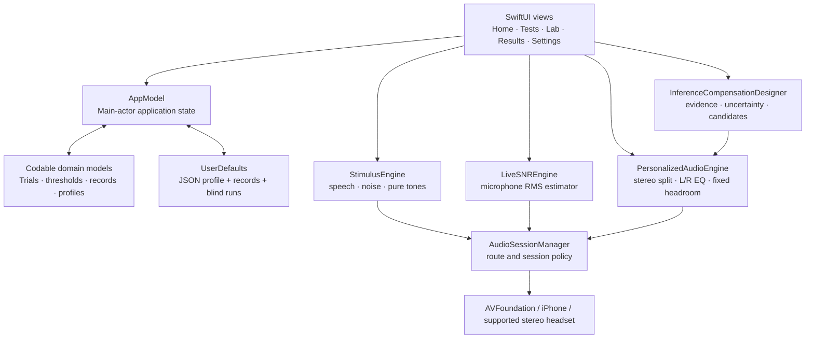

# Auditory Inference Lab — Research Prototype

Auditory Inference Lab is a separate experimental iPhone application that joins
bilateral relative pure-tone screening, bilingual speech-in-noise testing, and
predictive-listening behavior in a closed-loop personalization lab. It preserves
each protocol's original units, visualizes evidence quality and filter
uncertainty, proposes conservative left/right audio candidates, and records
blinded listening preferences over time.

Repository: <https://github.com/gjenaro/Auditory-Inference-Lab>

> [!IMPORTANT]
> Auditory Inference Lab is not a clinical audiometer, hearing aid, medical device, or diagnostic
> service. Pure-tone results are **relative hearing thresholds—not dB HL**.
> Results depend on the iPhone, headset model and fit, system volume, Bluetooth
> route, ambient noise, and uncalibrated device processing.

## What the app does

| Module | Current implementation | Output |
| --- | --- | --- |
| Live SNR | Microphone RMS tracking with rolling low/high percentiles | Relative speech, noise, and SNR estimates in dBFS/dB |
| Speech in noise | English or Spanish synthesized sentences mixed with six synthetic noises; 144-item non-repeating cycle per language | Trial scores, sigmoid, SNR50, SNR80, SNR90, optional bootstrap intervals |
| Speech Standard vs EQ | Two randomized, blinded 12-sentence blocks at fixed SNR; non-overlapping material matched by word, letter, vowel-group, and content-word checks | Standard/EQ word recognition, paired difference and approximate interval, material-balance audit, exact L/R filter |
| Bilateral pure tone | Separate left/right channels on stereo AirPods or Bose QuietComfort, pulsed tones, 10-down/5-up staircase, catch trials, 1 kHz retest | Eight-frequency relative audiogram and quality metrics |
| Predictive listening | 36 bilingual trials spanning semantic context, interrupted speech, misleading context, and consistent filtered speech | Context benefit, auditory-restoration benefit, prediction intrusions, adaptation gain, confidence, effort, timing, and reliability |
| Volume sensitivity | Six digital speech levels from −42 to −12 dBFS | Word recognition versus digital level |
| Noise profiles | Short adaptive speech runs by synthetic noise family | Per-noise SNR90 estimate |
| Personalized Audio | Independent eight-band left/right EQ derived from a saved bilateral result | Original/Compensated comparison for ten offline tracks |
| Inference Lab | Selectable tone, speech, and predictive records; uncertainty-aware candidate design; randomized A/B listening | Multidimensional profile, filter confidence, saved preferences, tentative personal recommendation, longitudinal change |

The interface supports English and Spanish instructions. Speech tests provide
four voice profiles: Woman, Man, and higher-pitch Girl/Boy simulations selected
from compatible voices installed on the device.

The Tests screen also provides a **Complete Listening Profile** guide. It keeps
the individual modules intact while tracking a recommended three-stage sequence:
bilateral pure tones → speech in noise → predictive listening. Each completed
stage is saved independently, so the listener can leave and resume between
modules.

## Architecture at a glance



The app uses only Apple frameworks: SwiftUI, Charts, AVFoundation, Foundation,
and Combine. It has no third-party package dependency and no application server.

Read the detailed design in [`docs/ARCHITECTURE.md`](docs/ARCHITECTURE.md).
The new personalization logic and its scientific claim boundaries are specified
in [`docs/INFERENCE_ENGINE.md`](docs/INFERENCE_ENGINE.md).
The behavioral rationale and exact predictive-listening protocol are documented
in [`docs/PREDICTIVE_LISTENING.md`](docs/PREDICTIVE_LISTENING.md).

## Scientific scope

The bilateral workflow borrows practical elements from conventional manual
air-conduction audiometry: familiarization, separate ears, a 1 kHz starting
frequency, the 1→2→3→4→6→8→1→0.5→0.25 kHz sequence, a 10-down/5-up search,
and a two-of-three ascending-response criterion. These elements are described in
the [ASHA Guidelines for Manual Pure-Tone Threshold Audiometry](https://www.asha.org/policy/GL2005-00014/).

Similarity of procedure does **not** make the result clinical. Conventional
audiometry requires calibrated equipment, standardized reference levels, a
controlled acoustic environment, appropriate transducers, masking when needed,
and trained interpretation. SNR Lab currently has none of the calibration needed
to convert its digital stimulus to SPL or dB HL.

The audiogram-like chart uses logarithmic frequency spacing and the conventional
right-ear red `O` / left-ear blue `X` visual distinction described by
[ASHA's audiometric-symbol guidance](https://www.asha.org/policy/gl1990-00006/),
but the ordinate is explicitly an uncalibrated relative scale.

See:

- [`docs/SCIENCE_AND_PHYSICS.md`](docs/SCIENCE_AND_PHYSICS.md) for units,
  waveforms, SNR, psychometrics, EQ, and calibration.
- [`docs/ALGORITHMS.md`](docs/ALGORITHMS.md) for exact state machines,
  constants, equations, and quality-score logic.
- [`docs/VALIDATION.md`](docs/VALIDATION.md) for what has and has not been
  validated.

The predictive-listening module measures behavioral responses to controlled
speech manipulations. It does not record brain activity and does not diagnose a
cognitive, neurological, or central auditory condition.

The Standard vs EQ module is a within-run exploratory comparison. The same
voice, synthetic masker, digital SNR, and master headroom are used in both
blocks. Speech and masker are mixed before the selected bilateral filter, so EQ
does not receive an artificial speech-only level advantage. Block order is
randomized and concealed until completion. A positive difference is descriptive
for that run, not proof of clinical or therapeutic benefit.

The neuroscience rationale, behavioral-to-neural claim boundaries, and a
preregistered-study pathway are documented separately. The repository links to
papers of record but does not redistribute copyrighted articles.

## Pure-tone screening summary

- Frequencies: 250, 500, 1000, 2000, 3000, 4000, 6000, and 8000 Hz.
- One ear at a time; the opposite digital channel is silent.
- Three 240 ms pulses with 140 ms gaps and 25 ms attack/release ramps.
- Random pre-stimulus delay of 0.85–2.15 seconds.
- Occasional silent catch trials and premature-tap tracking.
- Heard response: 10 relative units quieter; missed response: 5 units louder.
- Threshold: lowest ascending level heard at least twice and on at least 50% of
  ascending presentations at that level.
- Maximum 16 real presentations per frequency; fallback results are flagged.
- Repeated 1 kHz result per ear; differences above five relative units reduce
  the app's heuristic reliability rating.

All relative-level changes occur in a digital domain. Five relative units map to
3.75 dB of generated dBFS in the current implementation; this is not a 5 dB HL
clinical step.

## Closed-loop personalization

A saved bilateral pure-tone result is converted into separate left/right EQ
curves:

1. Find a within-ear lower-quartile reference threshold.
2. Keep only positive frequency-specific deviations from that reference.
3. Apply half gain.
4. Smooth each band with 60% center and up to 20% from each neighbor.
5. Limit boost to the user-selected 0–20 dB maximum.
6. Reserve global digital headroom equal to the largest boost plus 1 dB.

The first and last bands are low/high shelves; intermediate bands are parametric
filters with 0.8-octave bandwidth. Both Original and Compensated modes share the
same headroom attenuation to make switching less misleading.

The new Lab keeps four strategies available: Original, Tone profile,
Speech-aware, and Inference candidate. Low-reliability tone measurements reduce
the inference candidate's gain. Predictive metrics can adjust candidate strength
only in the 1–4 kHz region; they are not treated as evidence that equalization can
compensate for cognition. A and B labels randomly conceal strategy identity.
Every comparison uses the same master headroom, supports a no-difference answer,
and is saved locally. A tentative recommendation is shown only after at least six
trials, four non-ties, and a unique leader with at least three wins.

This is an experimental relative EQ—not a hearing-aid fitting rule, loudness
normalization standard, prescription, validated intervention, or guarantee of
improved intelligibility or fidelity.

## Data and privacy

- Profiles, up to 100 named test records, and up to 50 blinded personalization
  runs are JSON-encoded into `UserDefaults`.
- Predictive trials preserve stimulus, response, condition, score, timing,
  replay count, confidence, and effort locally for protocol audit and research.
- Standard/EQ trials preserve both sentence sets, pair assignment, typed answer,
  score, timing, replay count, fixed SNR/noise, plan seed, block order, selected
  audiogram identifier, and exact eight-band left/right filter.
- Microphone buffers are analyzed in memory and are not intentionally recorded.
- The app contains no analytics SDK, account system, advertising SDK, or network
  upload code.
- Ten demonstration tracks are bundled for offline playback.
- A Reset control clears the saved profile and test history.

See [`docs/DATA_AND_PRIVACY.md`](docs/DATA_AND_PRIVACY.md) and
[`PRIVACY.md`](PRIVACY.md) before distributing the app.

## Build and run

Requirements:

- macOS with a recent Xcode version capable of building for iOS 17.
- iPhone running iOS 17 or later.
- Apple Account for personal-device testing; Apple Developer Program membership
  for App Store distribution.
- Stereo AirPods or Bose QuietComfort headphones for the bilateral pure-tone
  workflow. The app validates the Bluetooth route name and two-channel output,
  then requires a manual left/right channel check.

Steps:

1. Open `AuditoryInferenceLab.xcodeproj`.
2. Select the `AuditoryInferenceLab` target and choose your signing team.
3. The new app uses `com.gjenaro.AuditoryInferenceLab`, allowing it to coexist
   with earlier SNR Lab builds. Replace it if that identifier is unavailable to
   your signing account.
4. Connect an iPhone and select it as the run destination.
5. Build and run.
6. Grant microphone access only if using Live SNR or the optional room-noise check.

Development and release notes are in
[`docs/DEVELOPMENT.md`](docs/DEVELOPMENT.md).

## Repository map

```text
AuditoryInferenceLab/
├── AuditoryInferenceLab.xcodeproj/
├── SNRLab/
│   ├── App/                 # app entry and persistent state
│   ├── Audio/               # capture, synthesis, test stimuli, stereo EQ
│   ├── Models/              # Codable records and numerical algorithms
│   ├── Resources/           # plist, assets, and offline music
│   └── Views/               # SwiftUI modules and charts
├── docs/                    # architecture, science, algorithms, validation
├── COPYRIGHT.md
├── PRIVACY.md
└── README.md
```

## Documentation index

- [Architecture](docs/ARCHITECTURE.md)
- [Science and physics](docs/SCIENCE_AND_PHYSICS.md)
- [Algorithms and constants](docs/ALGORITHMS.md)
- [Inference and personalization engine](docs/INFERENCE_ENGINE.md)
- [Data model and privacy](docs/DATA_AND_PRIVACY.md)
- [Validation and limitations](docs/VALIDATION.md)
- [Predictive listening protocol](docs/PREDICTIVE_LISTENING.md)
- [Neuroscience rationale and claim boundaries](docs/NEUROSCIENCE.md)
- [Paper bibliography and evidence map](docs/PAPER_BIBLIOGRAPHY.md)
- [Publication and study plan](docs/PUBLICATION_AND_STUDY_PLAN.md)
- [Development and release](docs/DEVELOPMENT.md)
- [References](docs/REFERENCES.md)
- [Software citation metadata](CITATION.cff)
- [Copyright](COPYRIGHT.md)
- [Bundled music license notes](SNRLab/Resources/DemoMusic/LICENSE.md)

## Project status

This project is a new iPhone MVP and engineering research prototype, version
0.2. Its complete Swift source passes iPhone SDK type-checking. The new
inference model also passes its deterministic profile, cap, recommendation, and
JSON round-trip checks. The matched speech-comparison planner passes deterministic
English/Spanish checks for trial count, unique material, condition balance, and
score calculations. Xcode completed a development-signed device build,
installed the distinct `com.gjenaro.AuditoryInferenceLab` bundle on `iPhone G`,
launched it, and reported the run complete on August 30, 2026. The new Lab has
not yet been acoustically calibrated, clinically validated, evaluated with actual AirPods/Bose
hardware end to end, accessibility-certified, security-audited, formally
usability-tested, or reviewed for regulatory distribution.

## Copyright

Copyright © 2026 Guillermo Jenaro. All rights reserved. See
[`COPYRIGHT.md`](COPYRIGHT.md). Bundled CC0/public-domain music is excluded from
this claim and documented separately.
