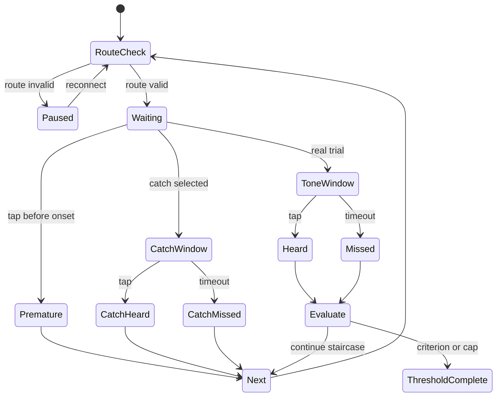

# Algorithms and implementation constants

This document is a code-level specification of the current MVP. Values here are
descriptive, not clinical recommendations. The source of truth remains the Swift
implementation.

## Bilateral pure-tone workflow

### Test targets

Each ear uses this sequence:

```text
1000 → 2000 → 3000 → 4000 → 6000 → 8000
     → repeat 1000 → 500 → 250 Hz
```

The application currently tests the left ear first and then the right ear. It
repeats 1 kHz in both ears even though some conventional procedures omit the
second-ear retest. This deliberate extra measurement supplies a symmetric
within-session quality check.

### Setup gates

Testing cannot begin until all are true:

- iOS reports a Bluetooth route named as AirPods or Bose QuietComfort/QC;
- the route reports at least two output channels;
- the listener confirms both sides are connected and seated consistently;
- Transparency or Aware mode is reported off by the listener;
- the listener agrees to preserve noise-control mode and system volume;
- the listener confirms a quiet room;
- audible left-only and right-only channel checks are confirmed.

An optional four-second microphone estimate records the rolling low-percentile
level in dBFS. Values above −42 dBFS receive a quality warning. This cutoff is an
uncalibrated engineering heuristic.

### Practice

Each ear receives a 1 kHz practice tone at −27 dBFS. Practice uses the same pulsed
generator and channel routing but does not enter the threshold record.

### Starting level

The staircase stores levels in five-unit increments from 0 to 80.

For the first frequency of an ear:

$$
r_0=35-10=25.
$$

For subsequent frequencies, the starting point is ten units below the most
recent non-retest threshold. The repeated 1 kHz starts ten units below the first
1 kHz threshold. Every result is rounded to a five-unit grid and clamped to
0…80.

### Presentation state



The pre-stimulus delay is uniformly random in 0.85…2.15 seconds. After onset, the
response window lasts 1.55 seconds. A normal tone lasts approximately one second,
so the remaining time permits a post-stimulus response.

### Catch scheduling

No catch is inserted before seven real, non-premature presentations in an ear.
After that:

- if at least 14 trials have occurred since the last catch, a catch is forced;
- if 8–13 trials have occurred, there is a 25% chance of a catch;
- otherwise, the next trial is real.

Catch trials do not change the staircase level. Premature taps are logged and the
trial is restarted without changing level.

### Staircase update

```text
if heard:
    nextLevel = max(0, currentLevel - 10)
else:
    nextLevel = min(80, currentLevel + 5)
```

Direction is derived by comparing the current presentation level with the prior
presented level. A reversal is counted when movement changes between ascending
and descending.

### Threshold criterion

For every level that has appeared on ascending trials, define:

$$
n_l=\text{ascending presentations at level }l,
\qquad h_l=\text{heard ascending presentations at }l.
$$

A level qualifies when

$$
h_l\ge2 \quad\text{and}\quad \frac{h_l}{n_l}\ge0.5.
$$

The result is the lowest qualifying level. At the zero-unit floor, two heard
responses also qualify even if direction classification is not ascending.

After 16 real presentations without a qualifying level, the algorithm saves the
lowest initial/ascending level with a heard fraction of at least 0.5, or the
current level if none exists. The result is marked `metAscendingCriterion=false`.

### Frequency progression

The next frequency is not started until the current staircase returns a result.
After the final 250 Hz target, the app compares the two 1 kHz thresholds. A
difference greater than five relative units prompts the listener to repeat that
ear. Accepting the ear continues to the other side or saves the bilateral test.

## Stored pure-tone observations

Every `PureToneTrial` stores:

- UUID;
- frequency;
- ear;
- optional relative stimulus level (`nil` for catch/premature events);
- heard/not heard;
- initial, ascending, descending, unchanged, or catch direction;
- optional response time;
- catch flag;
- premature-response flag;
- timestamp.

Every `PureToneThresholdResult` adds the final relative threshold, reversal count,
retest flag, ascending-criterion flag, and threshold timestamp.

## Quality metrics

### False-positive rate

$$
\mathrm{FPR}=\frac{\text{heard catch trials}}{\text{all catch trials}}.
$$

When no catch trial exists, the displayed rate is zero; absence of catches should
not be interpreted as proof of reliability.

### Reliability score

The score begins at 100 and applies these penalties:

| Condition | Penalty |
| --- | --- |
| Catch false-positive rate $f$ | $\min(45,100f)$ |
| $p$ premature taps | $\min(20,4p)$ |
| Mean 1 kHz repeat difference $d>5$ | $\min(25,2.5(d-5))$ |
| $u$ thresholds missing ascending criterion | $\min(20,5u)$ |
| Ambient estimate above −42 dBFS | 10 |

The final value is clamped to 0…100.

The test is flagged as reduced reliability if any is true:

- score below 75;
- false-positive rate above 20%;
- at least three premature taps;
- either ear's 1 kHz difference exceeds five relative units;
- any threshold used the presentation-cap fallback.

These constants have not been clinically validated. They are transparent quality
signals intended to support retesting, not formal confidence probabilities.

## Audiogram rendering

The eight standard display frequencies are mapped to

$$x=\log_2(f/250).$$

The chart plots $-r$ on a −80…0 y-domain. A left/right difference of 15 or more
relative units adds an orange vertical highlight. The 15-unit rule is a visual
attention threshold only; no cause or medical category is inferred.

## Speech-in-noise test

### Sentence allocation

Each language contains a 12-subject by 12-predicate matrix, giving 144 distinct
complete sentences. A persisted language-specific cursor allocates material
without replacement. For absolute position $a$, bank size $N=144$, cycle
$c=\lfloor a/N\rfloor$, and slot $s=a\bmod N$, the selected index is

$$
i=(37s+53c)\bmod 144.
$$

Because 37 and 144 are coprime, the 144 slots form a full permutation before a
language repeats a sentence. The cycle term changes the order of the next pass.
Speech-in-noise, volume-sensitivity, and noise-profile modules share this cursor,
preventing a sentence used in one of those modules from immediately reappearing
in another. English and Spanish advance independently.

### Trial loop

- 14 trials.
- Initial digital SNR: +6 dB.
- Noise family selected before trial 1 and then locked.
- English or Spanish sentence chosen by trial index from a built-in bank.
- Listener hears one generated sentence and types the perceived words.
- Score at least 0.72: next SNR is 2 dB lower/harder.
- Score below 0.72: next SNR is 2 dB higher/easier.
- SNR is clamped to −10…+18 dB.

The 72% rule and 2 dB step are MVP heuristics, not a standardized speech-in-noise
protocol.

### Word scoring

Text is folded case-insensitively and diacritic-insensitively, split on non-
alphanumeric characters, and compared as a multiset. For each reference word,
one matching response token is consumed. Word order and edit distance are not
considered.

$$
\mathrm{score}=\frac{\text{matched reference tokens}}
{\text{reference tokens}}.
$$

### Speech/noise amplitude

Generated speech is normalized toward active RMS 0.12, subject to 0.90 peak
headroom. Noise is scaled using

$$R_n=R_s/10^{S/20},$$

where $S$ is target digital SNR in dB. Final samples are clipped to ±0.95 as a
last software bound.

### Sigmoid fit

The grid search minimizes

$$
E(\theta,k)=\sum_i\left[
\frac{1}{1+e^{-(s_i-\theta)/k}}-y_i
\right]^2.
$$

Search domains are $\theta\in[-10,20]$ and $k\in[0.5,10]$, each in 0.25 dB
increments. SNR50 is $\theta$; SNR80 and SNR90 are analytic inversions of the
fitted logistic curve.

### Bootstrap intervals

With at least 12 points, 120 deterministic pseudo-random bootstrap samples are
drawn with replacement. Each is refit and the nearest 2.5% and 97.5% order
statistics form the displayed interval. The seeded generator makes results
repeatable for a fixed point count and sequence.

## Speech Standard versus EQ comparison

### Plan construction

1. Allocate 36 corpus candidates from the persisted English or Spanish cursor.
2. Remove exact text duplicates and require at least 24 unique sentences.
3. Greedily create 12 pairs. Pair distance is
   `12·|Δwords| + 0.35·|Δletters| + 1.5·|ΔvowelGroups| + 30·sharedContentWords`.
4. Orient each pair between Standard and EQ to minimize cumulative imbalance in
   those three complexity counts.
5. Shuffle each 12-item condition list and randomly select block order using a
   saved SplitMix64-style seed.

No sentence is repeated within a run. The large overlap penalty normally yields
zero shared content words inside each matched pair for the current corpora; the
observed maximum is stored and displayed rather than assumed.

### Fixed-condition playback

- 12 Standard and 12 Audiogram-EQ trials.
- One noise family and one digital SNR, defaulting to the current SNR80 and
  clamped to −5…+12 dB, remain fixed.
- Language, device voice profile, selected audiogram, and 0…20 dB filter cap
  remain fixed.
- Speech is normalized to active RMS 0.12 and the masker is scaled by
  $R_n=R_s/10^{S/20}$.
- Speech and masker are summed, peak-limited, duplicated to two mono paths, and
  passed through identical left/right graphs.
- Matched pair members use the same deterministic masker seed/prefix, derived
  from the saved plan seed and pair index.
- Standard bypasses EQ; Audiogram EQ enables the selected eight bands.
- Both use master attenuation of `maximumBoost + 1 dB`.

The score is the ordinary multiset word-correct fraction. The result reports
condition means, EQ minus Standard percentage points, paired differences, and a
normal-approximation interval when at least four pairs exist. Replays and
response times are retained for quality review. The procedure is exploratory
and does not update the adaptive SNR psychometric curve.

## Predictive listening

The 36-trial plan is built from four bilingual item pools. Within each block,
items are shuffled and a subset is selected:

```text
12 context trials:       alternating high and neutral context
10 interrupted trials:   alternating silent and noise-filled gaps
 6 misleading trials:    plausible but unexpected final words
 8 adaptation trials:    one consistent filtered-speech transform
```

Context and misleading trials use the latest fitted SNR80, clamped to −6…+14 dB.
If there is no saved speech curve, they use +4 dB. Interrupted speech uses a 3 Hz
gate with a 0.62 speech duty cycle and eight-millisecond edge ramps. The filtered
block applies the same 3.2 kHz low-pass, 3.2 Hz envelope modulation, and low-level
noise parameters on every item.

All trials use the ordinary multiset word scorer. Define $q$ as a score from zero
to one and overbars as condition means:

$$
C=100(\bar q_{high}-\bar q_{neutral}),
\qquad
R=100(\bar q_{noise\ gap}-\bar q_{silent\ gap}).
$$

If $I$ is the number of misleading trials answered with the contextually expected
word and $L$ is the number of misleading trials, prediction cost is

$$
P=100I/L.
$$

For the eight filtered trials, split the ordered block into four early and four
late scores:

$$
A=100(\bar q_{late}-\bar q_{early}).
$$

The protocol reliability score is

$$
Q=\min\left(100,\max\left(0,100c-4u-1.5r\right)\right),
$$

where $c$ is the completed fraction of the expected 36 trials, $u$ counts
response times below 0.25 seconds or above 120 seconds, and $r$ counts replays
beyond the first presentation. This is a heuristic process score, not measurement
uncertainty. The complete claim boundary is in
[`PREDICTIVE_LISTENING.md`](PREDICTIVE_LISTENING.md).

## Volume sensitivity

The test presents six clean-speech digital targets in this order:

```text
−42, −36, −30, −24, −18, −12 dBFS
```

Each sentence is scored with the same token algorithm. The resulting curve is a
within-device recognition-versus-digital-level display. It is not an acoustic
loudness-growth or speech-audiometry measurement.

## Noise profiles

Each noise family runs eight trials beginning at +6 dB digital SNR. The same
72%/±2 dB adaptive rule applies, bounded to −10…+18 dB. The saved summary is the
two-parameter sigmoid's SNR90 estimate.

Eight trials are too few for a strong psychometric inference in many conditions;
the module is exploratory and explicitly identifies its noises as synthetic.

## Live SNR

Constants:

| Item | Value |
| --- | --- |
| Input tap | 2048 frames |
| Recent level window | 120 buffers |
| Minimum data before publish | 8 buffers |
| Publish interval | >160 ms |
| Noise statistic | 20th percentile |
| Signal statistic | 82nd percentile |
| Display clamp | −10…40 dB |
| RMS floor before log | $10^{-8}$ |

The estimator records at most 180 display-history points.

## Personalized compensation

### Inputs and guards

- Only a saved `BilateralPureToneTest` is used.
- At least four non-retest thresholds must exist for each ear.
- Speech-in-noise values never enter the EQ calculation.
- User maximum is clamped to 0…20 dB.

### Per-ear gain calculation

For each ear, sort available thresholds and choose the element at index
`count / 4` as the reference. For every target frequency, use the closest measured
frequency and calculate nonnegative half gain:

```text
deficit = max(0, threshold - reference)
rawGain = min(maximumBoost, 0.5 * deficit)
```

Smooth the vector with center/neighbor weights of 0.60/0.20/0.20. Edge weights
are divided by their available sum. Clamp the result again to 0…maximum.

### Filter configuration

| Band | Center | Type |
| --- | ---: | --- |
| 1 | 250 Hz | Low shelf |
| 2 | 500 Hz | Parametric |
| 3 | 1 kHz | Parametric |
| 4 | 2 kHz | Parametric |
| 5 | 3 kHz | Parametric |
| 6 | 4 kHz | Parametric |
| 7 | 6 kHz | Parametric |
| 8 | 8 kHz | High shelf |

All filters use 0.80-octave bandwidth where the filter type uses bandwidth. A
band is bypassed when its absolute gain is below 0.05 dB.

### Playback/headroom behavior

The stereo file is split into temporary mono float32 CAFs. Each side passes
through its own player, EQ, and hard panner. A shared mixer attenuates both modes
by `largestBoost + 1 dB`. Switching Original/Compensated toggles EQ bypass without
changing playback position.

The maximum control limits the digital filter parameter; it does not state the
acoustic gain at the ear and must not be described as prescribed amplification.
