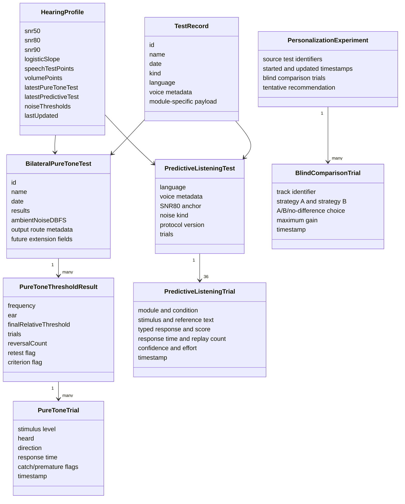

# Data model and privacy architecture

## Data principles

The current MVP is local-first:

- no Auditory Inference Lab account;
- no application backend;
- no analytics or advertising SDK;
- no HealthKit integration;
- no cloud synchronization implemented by the app;
- no export or sharing workflow;
- no raw microphone recording.

This architecture reduces network privacy exposure, but the stored results can
still be sensitive. Test names, response patterns, relative hearing profiles, and
speech-in-noise performance may reveal health-adjacent information about the
device owner. Treat exported backups, screenshots, development logs, and future
sharing features accordingly.

## Domain model



## Stored records

### `HearingProfile`

The profile is the latest cross-module summary:

- fitted speech SNR50/SNR80/SNR90 and slope;
- latest speech trial points;
- latest volume points;
- legacy single-curve frequency thresholds for backward compatibility;
- latest bilateral pure-tone test;
- latest predictive-listening test and trial payload;
- latest Standard-versus-EQ speech comparison and trial payload;
- latest per-noise thresholds;
- last-update timestamp.

### `TestRecord`

History records contain common metadata plus a module-specific payload:

- UUID, user-visible name, date, test kind, language;
- voice profile and actual resolved voice name where applicable;
- speech fit and individual points;
- volume points;
- legacy frequency thresholds;
- complete bilateral pure-tone test;
- noise kind and summary threshold.
- complete predictive-listening result, including the exact stimulus/reference,
  typed response, score, timing, replays, confidence, and effort for every trial.
- complete Standard/EQ result: both sentence lists and pair indices, typed
  answers, scores, timing, replays, surface-complexity metrics, noise/SNR, block
  order and seed, selected audiogram identifier/name/route, boost cap, and exact
  left/right filter bands.

History is newest-first and limited to 100 records.

### `PersonalizationExperiment`

Blind runs are stored separately from measurement history. A run links the
selected pure-tone, speech, and predictive record identifiers and stores every
track, randomized A/B strategy mapping, choice, maximum-gain setting, and
timestamp. Empty runs are not saved. Runs are newest-first and limited to 50.

### Bilateral pure-tone payload

The app saves complete trial-level observations so future versions can recalculate
quality metrics or audit a threshold decision. It stores:

- ear and frequency;
- every relative stimulus level;
- heard/missed response;
- presentation direction;
- response time;
- catch and premature responses;
- reversals;
- threshold timestamp and overall test timestamp;
- supported-headset route name, reported output channel count, and setup
  confirmation (`airPodsSetupConfirmed` is retained as a legacy compatibility
  field; new records also use `supportedHeadsetSetupConfirmed`);
- optional room-noise estimate in dBFS;
- setup-confirmation state.

Future optional fields reserve space for calibration, transducer identification,
bone conduction, masking metadata, imported source, and prior-test links. Empty
fields do not mean those features exist.

## Persistence

`AppModel` JSON-encodes the profile, history, and blind runs into `UserDefaults` under:

```text
auditoryinference.profile.v1
auditoryinference.history.v1
auditoryinference.experiments.v1
auditoryinference.language.v1
auditoryinference.voice.v1
auditoryinference.sentence-position.v1.english
auditoryinference.sentence-position.v1.spanish
```

`UserDefaults` is suitable for this MVP's small data volume but is not a full
clinical record store. The app does not implement database transactions,
encryption independent of iOS, record-level access control, tamper evidence,
retention schedules, audit logs, or schema migrations.

The data is inside the app sandbox. Device backups or device-management systems
may handle app data according to the user's iOS and organizational settings; SNR
Auditory Inference Lab does not control those external mechanisms.

## Microphone processing

Microphone access is requested for Live SNR and the optional room-noise estimate.
PCM buffers are reduced to RMS levels in memory. The app does not intentionally
write raw microphone samples to a file or include them in `TestRecord`.

The room check stores one relative noise-floor estimate. Live SNR stores only a
short in-memory chart history and does not persist that history across launches.

Bluetooth microphones may use a different route and processing chain from the
iPhone microphone. The selected input name is displayed, but no device-specific
calibration is applied.

## Speech and typed responses

Test sentences are embedded in the binary or composed locally from embedded
sentence parts. Speech audio is generated with installed iOS voices and mixed
locally. Typed responses are scored immediately. Ordinary speech-in-noise,
volume, and noise-profile records contain word-recognition fractions and test
points, not the typed response text itself.

Predictive Listening is different: it preserves the typed response together with
the exact stimulus/reference so its derived behavioral contrasts can be audited.
Those responses may contain unintended personal text if a listener types it.
They remain in the same local profile/history storage and are deleted by the
same Reset action. A future export or synchronization feature would require a
fresh privacy, consent, and data-minimization design.

The selected voice profile and the resolved system voice name are stored for
repeatability. iOS controls availability and any downloading of system voices
outside this app.

## Personalized Audio temporary files

The selected bundled stereo track is split into temporary left/right CAF files
to support independent equalization. These files contain only the bundled demo
music—not microphone input or user speech. The app removes its prior temporary
pair when loading a new track; iOS may also purge temporary storage. A production
version should additionally perform explicit cleanup on every lifecycle exit and
test interrupted-load behavior.

## Network behavior

The runtime contains no URL session, socket, analytics, authentication, or upload
implementation. Music playback is offline. The Music Credits screen contains a
normal link to the FreePD website; following it leaves the app's local processing
boundary and is governed by the destination's policies.

## Deletion

Settings offers “Reset all test data and history.” It replaces the saved profile,
history, and personalization experiments with empty values. Language and voice preferences remain. Uninstalling
the app normally removes its sandbox from the device, subject to iOS backup and
restore behavior outside the app.

A commercial version should add explicit retention documentation, granular
record deletion, export/delete verification, and a clear user-facing privacy
screen.

## App Store privacy preparation

Apple requires developers to describe app data practices and provide a privacy-
policy URL. See [Apple's app privacy guidance](https://developer.apple.com/help/app-store-connect/manage-app-information/manage-app-privacy/).

Before answering App Store privacy questions, re-audit the release binary rather
than relying only on this document. Adding telemetry, crash reporting, cloud
backup, account services, remote speech, support forms, or third-party SDKs can
change the disclosure.

## Threat and misuse considerations

| Risk | Current mitigation | Remaining work |
| --- | --- | --- |
| Another device user sees results | iOS app sandbox/device lock | Optional in-app lock and stronger record controls |
| Sensitive names entered as test names | Local storage only | Explain naming risk; granular deletion |
| Accidental cloud exposure through backup | App makes no upload | Document backup behavior; consider backup exclusion if justified |
| Misinterpretation as diagnosis | Repeated uncalibrated/non-diagnostic labels | Usability testing and review of every results surface |
| Future telemetry changes disclosure | No telemetry now | Release-time dependency and traffic audit |
| Temporary-file residue | Prior pair removed on next load | Cleanup on scene/background/termination paths |

## Public policy

[`PRIVACY.md`](../PRIVACY.md) is a human-readable policy matching the present
code. It must be reviewed and updated whenever implementation or distribution
changes.
