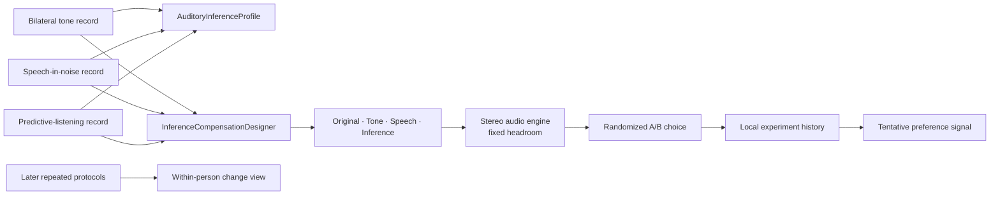

# Inference and personalization engine

## Purpose

Auditory Inference Lab tests a specific research workflow:

1. measure peripheral, speech-in-noise, and predictive-listening behavior with
   separate protocols;
2. retain raw results and protocol-specific reliability;
3. generate several conservative stereo-EQ candidates rather than one asserted
   “correct” prescription;
4. conceal candidate identities during music comparison;
5. learn from repeated personal choices and later measurements.

This is a hypothesis-generating engineering design. It has not established that
the candidate filters improve speech intelligibility, listening effort, music
fidelity, neural processing, or health outcomes.

## Why the modules stay separate

The app collects measurements with different meanings:

| Evidence | Native quantity | Interpretation boundary |
| --- | --- | --- |
| Pure tone | Relative threshold by frequency and ear | Uncalibrated digital level; not dB HL |
| Speech in noise | SNR50/SNR80/SNR90 and trial recognition | Performance on this app's material and conditions; not a standardized clinical score |
| Predictive listening | Percentage-point contrasts, intrusions, adaptation, effort | Behavioral task effects; not direct brain activity or cognitive diagnosis |
| Blind comparison | A/B/no-difference choice | Preference under the current track, level, headset, and moment; not clinical benefit |

The multidimensional screen presents these together but does not average their
physical units. Its 0–100 bars are explicitly app-internal visual transforms.
Raw values remain visible beside every bar.

## Multidimensional visual profile

The current transforms are descriptive UI mappings, not population norms:

- tone reliability = the pure-tone protocol reliability percentage;
- speech efficiency = clamp(65 − 4 × SNR50, 0, 100), where lower SNR50 maps upward;
- context use = clamp(50 + context benefit, 0, 100);
- auditory restoration = clamp(50 + restoration benefit, 0, 100);
- prediction control = clamp(100 − expected-intrusion percentage, 0, 100);
- adaptation = clamp(50 + adaptation gain, 0, 100);
- listening ease = clamp((6 − mean effort) / 5 × 100, 0, 100).

These transforms make mixed-direction effects legible in one interface. They
must not be used as diagnostic thresholds, age norms, intelligence measures, or
comparisons between people.

Profile completeness is the fraction of the three measurement families that is
available. Evidence confidence is the mean of their protocol-level reliability
values. A 24-trial speech run maps to 100% speech evidence completeness; this is
an implementation heuristic, not a validated confidence interval.

## Candidate filter family

All candidates use eight center frequencies per ear:

`250, 500, 1000, 2000, 3000, 4000, 6000, 8000 Hz`.

### Base tone-profile gain

For each ear independently:

1. choose the lower-quartile measured threshold as the within-ear reference;
2. calculate positive deviation from that reference at each band;
3. apply half gain;
4. smooth with 60% center weight and up to 20% from each adjacent band;
5. clamp gain to the listener-selected maximum from 0 to 20 dB.

This produces `g_base(f, ear)`. It is a relative frequency-shaping heuristic,
not a hearing-aid fitting rule.

### Per-band evidence

Every measured frequency receives evidence `E` from 0 to 1:

`E = 0.30C + 0.15P + 0.15R + 0.25G + 0.15T`

where:

- `C` is 1 when the ascending threshold criterion was met and 0.45 otherwise;
- `P` is presentation completeness, capped at eight presentations;
- `R` is reversal support, capped at two reversals;
- `G` is the global pure-tone reliability fraction;
- `T` is the ear's 1 kHz repeatability factor.

Missing frequency evidence is zero. This choice makes uncertainty visible and
reduces the inference candidate rather than rewarding missing or inconsistent
data.

### Four strategies

1. **Original**: zero EQ gain.
2. **Tone profile**: `g = g_base`.
3. **Speech-aware**: the base curve receives at most 15% additional scaling in
   the 1–4 kHz region as the selected app-relative SNR50 rises.
4. **Inference candidate**: the speech-aware curve receives at most 10%
   additional 1–4 kHz scaling from reliable restoration/intrusion task effects,
   then is multiplied by `0.55 + 0.45E`.

The inference candidate is therefore:

`g = clamp(g_base × w_speech × w_inference × (0.55 + 0.45E), 0, maximum)`.

Predictive results never create gain at a frequency where the tone-derived base
gain is zero. They only alter the strength of a candidate that the user must
evaluate blindly. This is an important claim boundary: equalization is not
presented as compensation for cognition.

### Displayed uncertainty

For a non-original candidate with applied gain `g`, the displayed uncertainty is:

`u = clamp((1 − E) × (1.5 + 0.55g), 0.35, maximum)`.

The graph plots `g ± u`, clipped to the 0–20 dB display range. This is a
transparent engineering uncertainty indicator, not a Bayesian posterior,
standard error, or clinical confidence interval. Future validation should
replace it with an empirically estimated distribution from repeated tests.

## Audio signal path and safety

Bundled stereo music is split into synchronized mono streams. Each stream passes
through its own eight-band EQ and hard left/right pan. The first and last bands
are shelves and the middle bands are parametric filters. The engine reserves
master headroom equal to the user-selected maximum plus 1 dB.

During blind comparison, Original and all candidates use the same master
attenuation. This reduces a simple louder-is-better bias, although it does not
guarantee equal perceived loudness because spectral balance itself changes
loudness.

The listener is instructed to start with a low, comfortable iPhone volume. The
app does not know ear-canal SPL, AirPods/Bose transfer functions, fit, device DSP,
or exposure dose. The 20 dB ceiling is a software limit, not a declaration that
20 dB of acoustic gain is safe.

## Blinded preference experiment

The app cycles through these candidate pairs:

- Original vs Tone profile;
- Original vs Speech-aware;
- Original vs Inference candidate;
- Tone profile vs Speech-aware;
- Tone profile vs Inference candidate;
- Speech-aware vs Inference candidate.

One six-trial cycle gives every strategy three appearances. For every trial,
pair order is randomized into labels A and B. The listener can switch filters
without changing playback position, choose A, choose B, or report no clear
difference. The app confirms that a choice was saved but does not reveal that
trial's hidden mapping. Stored fields include time, track, hidden mapping, choice,
measurement-source identifiers, and maximum gain.

A tentative preference signal appears only when all conditions hold:

- at least six total comparisons;
- at least four non-tie comparisons;
- a unique strategy has the most wins;
- that strategy has at least three wins.

The displayed percentage is wins divided by that strategy's non-tie appearances.
It is intentionally called a preference signal, not an efficacy result.

### Known experimental limitations

- There is no enforced replay of an identical fixed-duration segment.
- A listener may infer a candidate from its audible character.
- Pair scheduling is balanced over cycles but not counterbalanced across a study
  population.
- There is no repeated speech-in-noise outcome measurement with each active EQ.
- Track, genre, fatigue, expectation, system volume, and headset state can all
  confound preference.
- Six trials are enough for a UI signal, not statistical evidence.

For a publishable study, preregister hypotheses, lock volume and device mode,
counterbalance order, use repeated segments and multiple sessions, collect
clarity/comfort/effort separately, add objective task outcomes, and analyze
within-participant effects with uncertainty intervals.

## Longitudinal view

The first implementation compares the two most recent compatible records:

- mean absolute left/right pure-tone threshold change across common frequencies;
- latest minus previous SNR50;
- latest minus previous context benefit;
- latest minus previous adaptation gain.

Changes can arise from learning, attention, environment, fit, device mode, or
random variation. The app does not label them as improvement, decline, or
medical change.

## Architecture

Key files:

- `SNRLab/Models/InferenceModels.swift`: profile transforms, evidence model,
  candidate design, blind-trial records, and recommendation rule;
- `SNRLab/Views/InferenceLabView.swift`: source selection, profile, filter graph,
  A/B workflow, experiment history, and longitudinal summaries;
- `SNRLab/Audio/PersonalizedAudioEngine.swift`: stereo playback, independent EQ,
  and equal-headroom strategy switching;
- `SNRLab/App/AppModel.swift`: local persistence.

## Scientific context and differentiation

The app's novelty should be evaluated as a combination and study workflow, not
as ownership of its individual components. Multidimensional auditory profiles,
adaptive testing, preference-based personalization, phonemic restoration, and
ecological momentary assessment all have prior art. The experimental contribution
is the transparent closed loop that keeps those measures distinct, exposes
uncertainty, proposes multiple candidates, and asks the listener to verify them
blindly and longitudinally in one local-first mobile tool.

Relevant starting literature includes:

- Sanchez-Lopez et al., auditory profiles beyond the audiogram in the BEAR
  project: <https://pmc.ncbi.nlm.nih.gov/articles/PMC9598365/>.
- Song et al., Bayesian active learning for automated audiometry:
  <https://pmc.ncbi.nlm.nih.gov/articles/PMC8521968/>.
- Jensen and Durisala, preference-based hearing-aid personalization:
  <https://www2.imm.dtu.dk/pubdb/pubs/6184-full.html>.
- Wu et al., ecological momentary assessment in hearing research:
  <https://pubmed.ncbi.nlm.nih.gov/29956590/>.
- Başkent et al., phonemic restoration and hearing impairment:
  <https://doi.org/10.1016/j.heares.2009.11.007>.

These sources motivate research questions. They do not validate this app's
stimuli, transforms, filters, uncertainty display, or recommendation rule.

## Validation gates before stronger claims

1. Unit-test every transform, cap, missing-data path, random mapping, persistence
   round trip, and recommendation boundary.
2. Verify channel isolation, filter response, clipping margin, and switching
   artifacts with instrumented audio output.
3. Measure test-retest reliability for every protocol and replace heuristic
   uncertainty with empirical estimates.
4. Compare pure-tone output with calibrated reference equipment per supported
   headset/device configuration.
5. Run preregistered blinded studies comparing preference and objective speech
   outcomes across candidates.
6. Conduct accessibility, privacy, security, human-factors, and regulatory review
   before public health or medical positioning.
