# Neuroscience rationale and claim boundaries

SNR Lab QC combines behavioral tasks that probe different stages of listening.
It does **not** measure the brain. The app records button presses, typed words,
confidence, effort, timing, and audio-test conditions; it has no EEG, MEG, fMRI,
ECoG, pupillometry, or physiological sensor. A behavioral pattern can be
consistent with a mechanism described in neuroscience without identifying that
mechanism in an individual listener.

This distinction is central to every scientific claim in the project.

## From sound pressure to a behavioral response

```mermaid
flowchart LR
    Sound["Acoustic waveform"]
    Cochlea["Cochlea<br/>frequency analysis and transduction"]
    Nerve["Auditory nerve"]
    Subcortical["Brainstem and midbrain<br/>timing, binaural and spectral processing"]
    Thalamus["Auditory thalamus"]
    Cortex["Auditory cortex<br/>spectrotemporal representation"]
    Network["Distributed networks<br/>attention, language, memory, prediction"]
    Decision["Perceptual decision"]
    Response["Tap or typed response"]

    Sound --> Cochlea --> Nerve --> Subcortical --> Thalamus --> Cortex
    Cortex <--> Network
    Network --> Decision --> Response
```

The app observes only the stimulus generated near the left side of this diagram
and the response at the far right. Every intervening stage can affect the result.
Attention, language familiarity, device latency, motor timing, strategy, fatigue,
and expectations therefore matter even in a nominally simple detection task.

## Frequency and tonotopy

The cochlea performs a mechanical frequency analysis: different locations along
the basilar membrane respond preferentially to different frequency ranges. This
ordered frequency representation is preserved in several parts of the auditory
pathway. Human fMRI has also demonstrated organized frequency preferences in
auditory cortex, including adjacent mirror-symmetric tonotopic maps
([Formisano et al., 2003](https://doi.org/10.1016/S0896-6273(03)00669-X)).

The app's eight test frequencies sample behavioral audibility across frequency;
they do not image a tonotopic map, localize a lesion, or separate cochlear from
neural causes. With uncalibrated consumer headphones, they also do not establish
clinical dB HL thresholds.

## What the three core modules probe

| Module | Primary behavioral demand | Important additional influences | What it cannot establish |
| --- | --- | --- | --- |
| Bilateral pure tone | Detect a pulsed tone in one digital channel | Headset transfer, fit, ambient noise, attention, criterion, cross-hearing | Clinical threshold, lesion site, cochlear or neural diagnosis |
| Speech in noise | Recognize words while target speech competes with a masker | Language, voice, vocabulary, attention, masker statistics, device processing | A clinical speech score or a unique neural cause |
| Predictive listening | Use context, restore interrupted material, resist misleading context, and adapt to a stable distortion | Memory, literacy, language proficiency, confidence, fatigue, learning | A direct measurement of predictive coding or cortical activity |

Keeping these modules separate is scientifically useful. Similar pure-tone
profiles can coexist with different speech-in-noise performance, and a context
benefit is not interchangeable with an SNR threshold.

## Bottom-up evidence and top-down expectations

Speech perception combines incoming acoustic evidence with prior knowledge.
High-predictability sentences can constrain likely words, whereas low-context or
misleading sentences make the sensory evidence carry more of the decision.

The app reports a **context benefit** as a within-session behavioral contrast. It
does not equate that contrast with one brain region or computational theory.
Primary studies motivate the manipulation:

- The original SPIN work controlled sentence-final word predictability and
  demonstrated the value of separating contextual support from intelligibility
  in noise ([Kalikow, Stevens, and Elliott, 1977](https://doi.org/10.1121/1.381436)).
- Concurrent EEG/MEG work with degraded words and prior written information found
  results consistent with feedback integration of prior knowledge and sensory
  evidence ([Sohoglu et al., 2012](https://doi.org/10.1523/JNEUROSCI.5069-11.2012)).

SNR Lab QC uses original bilingual sentence material and a different protocol.
It is not the SPIN test and does not reproduce the EEG/MEG experiment.

## Filling in missing speech

Phonemic restoration is the perceptual experience of speech content that has
been physically removed and replaced or masked by another sound. Warren's early
behavioral experiment established the phenomenon
([Warren, 1970](https://doi.org/10.1126/science.167.3917.392)). Direct cortical
recordings later showed activity associated with the perceived missing phoneme
in bilateral auditory cortex, preceded by prediction-related patterns in left
frontal cortex in the studied participants
([Leonard et al., 2016](https://doi.org/10.1038/ncomms13619)).

The app's interrupted-speech conditions produce a behavioral **restoration
benefit** by comparing noise-filled and silent gaps. The manipulation is broader
than a phoneme-specific laboratory paradigm. A positive score is not evidence
that the same cortical sequence occurred in that listener; only a suitably
instrumented neuroscience study could test that proposition.

## Adaptation and perceptual learning

Listeners can improve rapidly when a distortion is consistent. Experiments with
noise-vocoded sentences found strong learning and showed that lexical information
can guide adaptation ([Davis et al., 2005](https://doi.org/10.1037/0096-3445.134.2.222)).

The app reports early-versus-late performance in a short block with a consistent,
exploratory filter. This is a within-session adaptation indicator. It should not
be interpreted as durable neural plasticity, rehabilitation, or transfer to
everyday listening without longitudinal controls.

## Attention and listening effort

Degraded speech recruits limited attentional resources. An fMRI study found that
processing degraded speech depended critically on attention
([Wild et al., 2012](https://doi.org/10.1523/JNEUROSCI.1528-12.2012)).
Pupillometry has also been used as an objective correlate of effort under
difficult speech conditions
([Zekveld, Kramer, and Festen, 2010](https://doi.org/10.1097/AUD.0b013e3181d4f251)).

SNR Lab QC records a listener's self-reported effort. It does not measure pupil
dilation or neural workload. Effort, accuracy, and confidence should be analyzed
as distinct outcomes because a listener can maintain accuracy by investing more
effort.

## A useful conceptual model

For research planning, a response can be represented as a conditional
probability rather than as a single sensory threshold:

$$
P(R\mid S,C,L,A,D,H),
$$

where $R$ is the observed response, $S$ the acoustic stimulus, $C$ contextual
information, $L$ language experience, $A$ attention, $D$ device and environment,
and $H$ the listener's hearing-related state. This notation is a study-design
reminder, not an implemented neural model.

The app's predictive measures are simple contrasts:

$$
B_\mathrm{context}=\bar{y}_\mathrm{high-context}-\bar{y}_\mathrm{low-context},
$$

$$
B_\mathrm{restoration}=\bar{y}_\mathrm{noise-gap}-\bar{y}_\mathrm{silent-gap},
$$

$$
I_\mathrm{prediction}=\frac{N_\mathrm{context-consistent\ errors}}
{N_\mathrm{eligible\ misleading\ trials}},
$$

$$
G_\mathrm{adaptation}=\bar{y}_\mathrm{late}-\bar{y}_\mathrm{early}.
$$

They are behavioral summaries with measurement error. A publishable study should
model trials directly when possible rather than treating a short-session point
estimate as a stable trait.

## Confounds that must be recorded or controlled

- Age, self-reported hearing history, tinnitus, current illness, and fatigue.
- Primary language, Spanish/English proficiency, literacy, dialect, and accent.
- Headphone model, firmware when available, fit, side orientation, iPhone model,
  iOS version, system volume, and noise-control mode.
- Ambient noise and room, test time, recent sound exposure, and interruptions.
- Voice profile, masker, sentence list, test order, practice, and replay count.
- Motor or vision limitations affecting taps or typed responses.

These variables can explain behavioral variation without implying a change in
auditory neural processing.

## Future neuroscience validation

A future neuroscience project should be a separate, ethics-approved protocol,
not a hidden extension of consumer app analytics. A defensible sequence is:

1. Freeze versioned audio stimuli and export exact onset markers.
2. Validate acoustic output with appropriate couplers and calibrated equipment.
3. Pre-register behavioral contrasts and neural hypotheses.
4. Synchronize the task with EEG/MEG or an imaging system and quantify timing
   uncertainty end to end.
5. Include sensory, context, attention, language, and motor-control conditions.
6. Separate confirmatory hypotheses from exploratory decoding.
7. Report null results, exclusions, preprocessing, multiplicity correction, and
   out-of-sample validation.

Intracranial recording would only be ethically appropriate in participants
already undergoing monitoring for clinical reasons, under independent clinical
and institutional oversight. This app provides no justification for an invasive
procedure.

## Responsible language

Acceptable: “behavioral context benefit,” “result is consistent with use of
context,” “hypothesis-generating,” and “relative threshold.”

Not acceptable without new evidence: “measures predictive coding,” “maps the
brain,” “detects auditory-processing disorder,” “diagnoses hidden hearing loss,”
“clinical audiogram,” or “neural compensation.”

See [`PAPER_BIBLIOGRAPHY.md`](PAPER_BIBLIOGRAPHY.md) for the evidence map and
[`PUBLICATION_AND_STUDY_PLAN.md`](PUBLICATION_AND_STUDY_PLAN.md) for a path from
prototype to a reproducible behavioral study.
