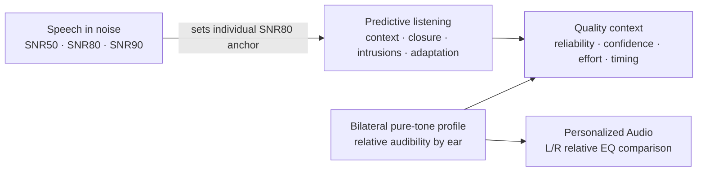

# Predictive listening protocol

## Purpose and claim boundary

The Predictive Listening module extends SNR Lab from peripheral audibility and
speech-in-noise measurement into four observable aspects of difficult-speech
behavior:

1. benefit from constraining semantic context;
2. reconstruction of periodically interrupted speech;
3. expectation-driven word intrusions when context is misleading;
4. short-term improvement while listening to a consistent degraded signal.

The module records answers, scores, timing, confidence, effort, and replay count.
It does **not** record electrical, magnetic, hemodynamic, or other neural activity.
Its results must not be described as a direct measurement of the brain or as a
diagnosis of cognition, auditory-processing disorder, dementia, or a neurological
condition.

The current protocol is an exploratory behavioral research measure. Its sentence
lists, system voices, signal transformations, trial counts, scoring, and summary
metrics have not been normed or clinically validated.

## Why these conditions are included

Speech comprehension is not determined by audibility alone. Linguistic context
can constrain a likely word, listeners may perceive continuity when speech is
replaced by an extraneous sound, and recognition can improve after exposure to a
stable distortion. The protocol makes those influences visible without claiming
to isolate one neural mechanism.

The design is informed by, but is not a reproduction of:

- Kalikow, Stevens, and Elliott's controlled-predictability speech-in-noise
  materials: <https://doi.org/10.1121/1.381436>
- Warren's report of perceptual restoration when speech was replaced by an
  extraneous sound, contrasted with a silent gap:
  <https://doi.org/10.1126/science.167.3917.392>
- Davis and colleagues' experiments on perceptual learning of noise-vocoded
  sentences: <https://doi.org/10.1037/0096-3445.134.2.222>

SNR Lab uses original bilingual application materials rather than copying those
experimental corpora.

## End-to-end relationship

The modules remain analytically separate. Pure-tone relative thresholds do not
enter the SNR sigmoid. SNR values do not enter the compensation filter. The only
cross-module dependency in Predictive Listening is an optional difficulty anchor:
the latest SNR80 is used for context and misleading-context trials. If no speech
curve exists, the anchor is +4 dB digital SNR.

## Test flow

The listener selects English or Spanish, one of four voice profiles, a synthetic
background, and a test name. The language, voice, SNR anchor, and background are
locked when the run begins.

The run contains 36 trials in four blocks:

| Block | Trials | Response | Conditions |
| --- | ---: | --- | --- |
| Semantic context | 12 | final word | 6 high-context, 6 neutral-context |
| Auditory closure | 10 | full sentence | 5 silent-gap, 5 noise-filled-gap |
| Prediction cost | 6 | final word | strongly expected ending replaced by a plausible unexpected word |
| Degraded-speech adaptation | 8 | full sentence | same exploratory filter for the whole block |

Items are randomly selected from larger bilingual block-specific pools for each
run. Correct answers are withheld until the run is complete, preventing trial
feedback from intentionally training later responses. Replays are permitted for
accessibility but are recorded and reduce the heuristic reliability score.

For each item, the listener also reports confidence and listening effort on
1-to-5 scales. These ratings are subjective and are not interchangeable with
accuracy.

## Stimulus construction

### Context and misleading-context blocks

Speech is synthesized locally by iOS, normalized toward an active RMS of 0.12,
and combined with the chosen synthetic background at the saved SNR80 anchor:

$$
R_n=\frac{R_s}{10^{S/20}},
$$

where $R_s$ is active speech RMS, $R_n$ is target noise RMS, and $S$ is digital
SNR in dB. This is a signal-domain ratio, not an eardrum or calibrated acoustic
SNR.

### Interrupted-speech block

The synthesized waveform is gated at 3 cycles per second. Approximately 62% of
each cycle retains speech and 38% is removed. Eight-millisecond edge ramps reduce
switching clicks.

- **Silent-gap:** removed samples become zero.
- **Noise-filled-gap:** removed samples become locally generated random noise;
  the missing speech samples remain absent.

The two conditions therefore have the same nominal gate timing. Any score
difference is summarized as a restoration benefit, but it can also reflect the
exact materials, voice, random noise realization, attention, typing, or other
uncontrolled factors.

### Degraded-speech block

The current exploratory transformation applies:

- a first-order low-pass response with a nominal 3.2 kHz pole;
- envelope modulation at 3.2 Hz between factors 0.66 and 1.0;
- additive random noise with sample amplitude up to 0.012;
- final normalization toward active RMS 0.10 and a ±0.90 sample bound.

This is intentionally called **filtered speech**. It is not a validated
noise-vocoder, cochlear-implant simulation, or model of a specific pathology.
The implementation holds the transformation parameters constant across the
eight-item block so early-to-late performance can be compared.

## Scoring

Text is folded case- and diacritic-insensitively, tokenized at non-alphanumeric
characters, and scored as a multiset of words:

$$
q=\frac{\text{matched reference tokens}}{\text{reference tokens}}.
$$

Final-word trials therefore produce a score of either 0 or 1 in normal use. Full
sentences can receive partial credit. Word order and spelling edit distance are
not currently modeled.

### Summary metrics

All accuracy and change measures are reported in percentage points:

$$
\text{ContextBenefit}=100(\bar q_{high}-\bar q_{neutral}),
$$

$$
\text{RestorationBenefit}=100(\bar q_{noise\ gap}-\bar q_{silent\ gap}),
$$

$$
\text{PredictionCost}=100\frac{\text{expected-word intrusions}}
{\text{misleading-context trials}},
$$

$$
\text{AdaptationGain}=100(\bar q_{late}-\bar q_{early}).
$$

For prediction cost, lower is better under this task definition. For the other
three, a positive number is a within-run benefit or improvement. Negative values
are retained and displayed; the app does not assign medical categories.

The protocol reliability score begins with test completion and subtracts four
points for each response time below 0.25 seconds or above 120 seconds and 1.5
points per replay beyond the first presentation. It is clamped to 0…100. This is
a transparent engineering score, not a statistical probability of correctness.

## Stored data

Every `PredictiveListeningTrial` stores:

- module and condition;
- prompt identifier;
- exact synthesized stimulus text and scoring reference;
- expected intrusion word when applicable;
- typed response and word score;
- whether the expected intrusion occurred;
- digital SNR and noise kind when applicable;
- response time measured from the Play action;
- presentation count;
- confidence and effort;
- timestamp and UUID.

The enclosing `PredictiveListeningTest` stores the test name, date, language,
requested voice profile, resolved installed voice name, SNR80 anchor, background,
all 36 trials, and a protocol version. The latest result and the history record
are saved locally through `AppModel`.

## Interpretation and confounds

These metrics are within-app contrasts, not normative scores. They are sensitive
to at least:

- peripheral hearing and audibility;
- language proficiency, dialect, vocabulary, literacy, and typing;
- age, attention, memory, fatigue, practice, and motivation;
- iPhone/headset route, fit, volume, voice, and processing;
- ambient noise and the selected synthetic background;
- sentence equivalence and random item assignment;
- replay behavior and subjective rating use.

A scientifically stronger study should pre-register hypotheses, freeze and
version the audio stimuli, use balanced equivalent lists, counterbalance order,
add repeat sessions and control conditions, validate language variants with
native speakers, and compare results with independent reference measures. A
future protocol should also measure the actual stimulus offset before reporting
post-stimulus reaction time.

## Extension points

The typed model and protocol version support later additions such as:

- fixed recorded talkers and calibrated waveform assets;
- larger balanced corpora and list-equivalence metadata;
- adaptive SNR selection within each condition;
- phoneme- or keyword-level scoring;
- randomized/counterbalanced block order;
- response alternatives for users who cannot type;
- repeat-session and longitudinal estimates;
- CSV/JSON research export with explicit consent;
- pre-registered normative or clinical studies.

Any such change must increment the protocol version when it changes stimulus
generation, scoring, trial allocation, or interpretation.
